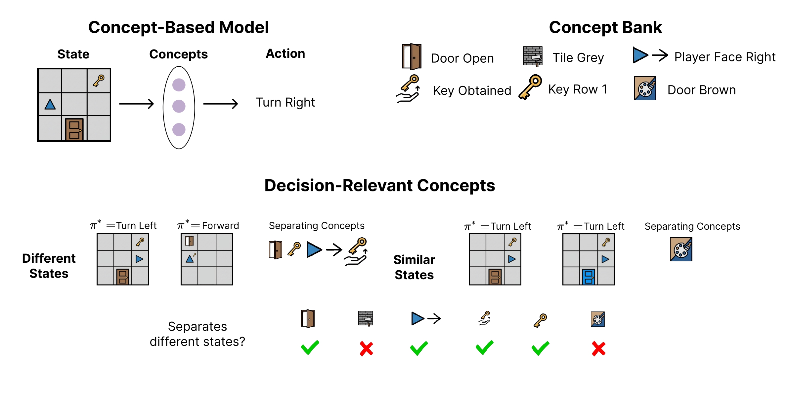

# Selecting Decision-Relevant Concepts in Reinforcement Learning

**Naveen Raman, Stephanie Milani, Fei Fang**  
Carnegie Mellon University · New York University · Johns Hopkins University

[[Paper]](https://arxiv.org/abs/XXX) · [[Project Page]](https://naveenraman.com/projects/concept-rl/)



Concept-based models make RL policies interpretable by routing decisions
through human-understandable boolean features. The catch: you have to choose
which concepts to use. This paper formalises that choice and gives the first
algorithms with performance guarantees for automatic concept selection.

Our key insight is that a concept is *decision-relevant* if and only if it
separates states that require different actions. We connect this to state
abstraction theory and derive a tractable LP that finds the optimal subset.

---

## Installation

```bash
git clone https://github.com/naveenr414/concept_decisions
cd concept_decisions
bash install.sh
conda activate concept-selection
```

Gurobi is required for DRS and DRS-log (the LP-based methods).
A free academic licence is available at [gurobi.com](https://www.gurobi.com/academia/academic-program-and-licenses/).
The variance and random baselines work without Gurobi.

---

## Quick Start

The package exposes four functions. All of them take a trained policy and a
list of concept functions, and return the indices of the selected concepts.

```python
import concept_abstraction as ca

# Your inputs
policy   = PPO.load("checkpoints/my_policy")   # any SB3-compatible policy
concepts = [c1, c2, c3, ...]                   # list of f(obs) -> {0, 1}
gym_env      = make_vec_env("MyEnv-v0", n_envs=8)  # standard gymnasium VecEnv
```

For example, to train with Mini-Grid, you can run
```python
import concept_abstraction as ca
from concept_abstraction.training import train_ppo
from concept_abstraction.concept_bank import get_concepts
from concept_abstraction.environments import get_environment

SEED = 42
ENV  = "mini_grid"

# ── 1. Build the MiniGrid environment ────────────────────────────────────────
concepts, _ = get_concepts(ENV)
vec_env, gym_env = get_environment(ENV, concept_list=None, seed=SEED)

# ── 2. Train the base policy (pi*) ───────────────────────────────────────────
policy = train_ppo(
    vec_env,
    ENV,
    seed=SEED,
    total_timesteps=250_000,
    policy="CnnPolicy",
)
```

**DRS** — optimal concept selection for ground-truth (perfect) concept predictors:

```python
idx = ca.DRS(policy, concepts, gym_env, k=5)
selected = [concepts[i] for i in idx]
```

**DRS-log** — use this when your concepts are *predicted* by a CNN (imperfect):

```python
# acc_list[i] = accuracy of your predictor on concept i, in [0, 1]
idx = ca.DRS_log(policy, concepts, gym_env, k=5, acc_list=acc_list)
```

If you don't have accuracy estimates yet, you can train a predictor and get
them automatically:

```python
predictor, acc_list = ca.train_concept_predictor(gym_env, policy, concepts, concept_idx=range(len(concepts)),environment_string=ENV)
idx = ca.DRS_log(policy, concepts, gym_env, k=5, acc_list=acc_list)
```

**Baselines**:

```python
idx = ca.variance(policy, concepts, gym_env, k=5)
idx = ca.random(concepts, k=5)
idx = ca.greedy(policy, concepts, gym_env, k=5)
```

### What are concept functions?

Each concept is a function `f(obs) -> int` that maps a raw environment
observation to 0 or 1. For example:

```python
# CartPole: is the pole leaning right?
def pole_right(obs):
    return int(obs[2] > 0)

# MiniGrid: is the door open?
def door_open(obs):
    return int(obs[7] == 1)

concepts = [pole_right, door_open, ...]
```

The `env` must include the raw observation in its info dict under
`info["observation"]` so that concept functions can be evaluated during
rollouts. The built-in environments in this repo all do this automatically;
see `environment_wrappers.py` if you want to wrap your own env.

---

## Reproducing Paper Results

All experiments from the paper can be reproduced with a single script:

```bash
bash reproduce_results.sh
```

This will run training, concept selection, and evaluation for all
environments (CartPole, MiniGrid, Pong, Boxing, Glucose) and write all results to the `results/` folder. Figures are generated from the `plot_results.ipynb` file. 

To reproduce a specific experiment:

```bash
# Train prerequisites (ground-truth policies + concept predictors)
python scripts/train_prerequisites.py

# Run concept selection comparison
python scripts/run_experiment.py --config scripts/configs/main_perfect.yaml

# Generate figures
jupyter nbconvert --to notebook --execute plot_results.ipynb
```

Config files for each experiment are in `scripts/configs/`:

---

## CUB Bird Classification

The CUB experiments require additional data setup.

1. Download the standard CUB-200-2011 preprocessed split from
   [Kaggle](https://worksheets.codalab.org/bundles/0xd013a7ba2e88481bbc07e787f73109f5) and
   place the resulting `.pkl` files in `data/cub/`.

2. Download the concept-prediction error files (`train_error.pkl`,
   `val_error.pkl`, `test_error.pkl`) from
   [Zenodo](https://zenodo.org/records/18827396) into `data/cub/`. We also provide the `train.pkl`, `val.pkl`, and `test.pkl` files for convenience. 

3. Run:
   ```bash
   python scripts/run_experiment.py --config scripts/configs/cub.yaml
   ```

---

## Repository Structure

```
concept_decisions/
├── reproduce_results.sh          # reproduces all paper experiments
├── plot_results.ipynb            # generates all figures
├── environment.yaml              # conda environment
├── setup.py
|── install.sh
│
├── scripts/
│   ├── train_prerequisites.py    # train policies + concept predictors
│   ├── run_comparison.py         # run concept selection + eval
│   ├── run_experiment.py         # single experiment runner
│   ├── accuracy_sweep.py         # sweep over k
│   ├── get_runtimes.py           # timing experiments
│   ├── supervised_learning.py    # CUB supervised experiments
│   └── configs/                  # per-experiment YAML configs
│
├── concept_abstraction/          # library (importable)
│   ├── __init__.py               # public API: DRS, DRS_log, variance, etc.
│   ├── _api.py                   # API implementation
│   ├── selection.py              # LP solvers (drs, drs_log, etc.)
│   ├── concept_bank.py           # concept definitions per environment
│   ├── environments.py           # environment builders
│   ├── environment_wrappers.py   # VecConceptWrapper, ConceptWrapper, etc.
│   ├── env_utils.py              # Q-estimation, rollouts, evaluation
│   ├── training.py               # PPO training, concept predictor training
│   ├── utils.py                  # result I/O
│   ├── plotting.py               # figure helpers
│   └── glucose_env.py            # glucose environment
│
├── data/
│   └── cub/
│       └── manual_concepts.txt   # manually curated CUB concept list
│
├── figures/                      # generated figures (tracked by git)
└── results/                      # experiment outputs (gitignored)
```

---

## Citation

```bibtex
@inproceedings{raman2026decisionrelevant,
  title     = {Selecting Decision-Relevant Concepts in Reinforcement Learning},
  author    = {Raman, Naveen and Milani, Stephanie and Fang, Fei},
  journal={arXiv preprint arXiv:XXXX.XXXXX},
  year={2026}
}
```